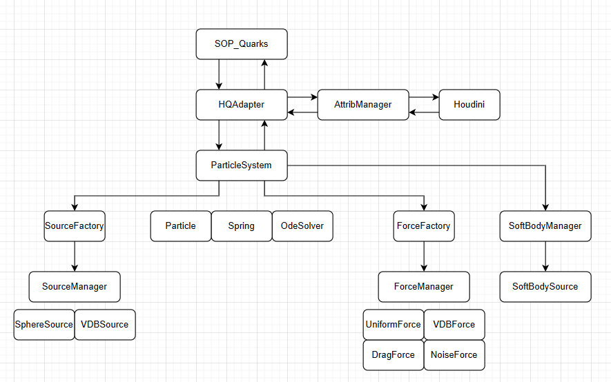

# Quarks
Quarks is a particle dynamics and cloth solver written in C++ along with 
a Houdini HDK plugin that makes it accessible within Houdini. 

https://vimeo.com/121535322

## Features
- Particle dynamics
- Cloth simulation (mass-spring system)
- Sources (Sphere, VDB etc.)
- Forces (Uniform, Drag, Noise, VDB, Vortex etc.)
- Collision detection (VDB collisions)
- Houdini HDK plugin
- Multithreading
- Houdini Digital Assets
- Houdini Example Files

## Dependencies
- Boost 1.85
- Houdini 20
- CMake 3.6

## Quarks Class Diagram

## Quarks HDK Plugin + Houdini Digital Assets

